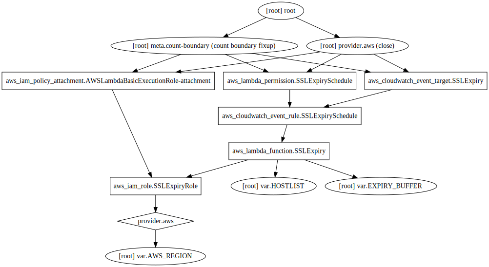

# SSLExpiry terraform


Deploy [LucasRoesler/ssl-expiry-check](https://github.com/LucasRoesler/ssl-expiry-check) to AWS Lambda easily with terraform to check for ssl certificates expiration.



## Related documentation

* [Terraform lambda aws example](https://github.com/terraform-providers/terraform-provider-aws/tree/master/examples/lambda)
* [Terraform documentation](https://www.terraform.io/docs/)

## Getting Started

Setup aws using env vars: https://www.terraform.io/docs/providers/aws/index.html#environment-variables

```bash
export AWS_PROFILE=your-aws-profile-example
```

## Generate `ssl-expiry-check.zip`

```bash
git clone git@github.com:LucasRoesler/ssl-expiry-check
cd ssl-expiry-check
git checkout v1.0.0 # actual version to deploy
zip -r ssl-expiry-check.zip {*.py,*.yml}
mv ssl-expiry-check.zip ../
cd ..
```

### See what's going to be applied

```bash
terraform plan
```

### Apply the changes

```bash
terraform apply
```

### Generate a graph of the plan

```bash
terraform graph -draw-cycles | dot -Tsvg -o graph.svg
open graph.svg
```

## Debugging

In case you get an unclear error message

```bash
TF_LOG=TRACE terraform your_command
```

## License

[MIT](LICENSE.md) © [Gabriel Le Breton](https://gableroux.com)
